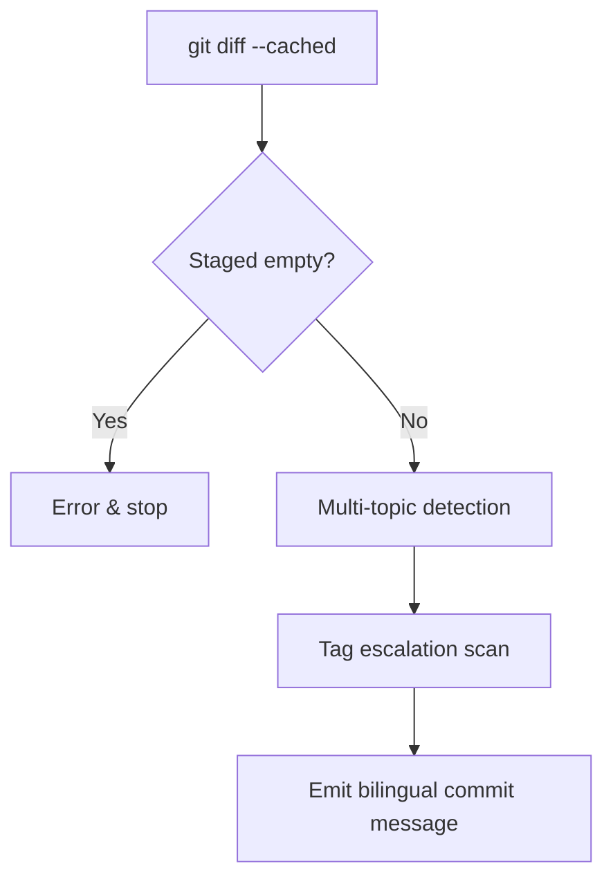

> [!NOTE]
> This README was generated by [SKILL](https://github.com/pardnchiu/skill-readme-generate), get the ZH version from [here](./doc/README.zh.md).

***

<strong>WRITE BILINGUAL COMMITS FROM STAGED DIFF WITH STRICT TAG DISCIPLINE!</strong>

***

> A Claude Code skill that generates bilingual commit messages from staged diff with mandatory tag escalation and multi-topic detection

## Table of Contents

- [Features](#features)
- [Built With](#built-with)
- [Architecture](#architecture)
- [License](#license)

## Features

> `/commit-generate` · [Documentation](./doc/doc.md)

- **Bilingual One-Shot Output** — Emits English subject and Traditional Chinese body in a single pass so the two never drift apart.
- **Staged-Only Strict Input** — Reads only `git diff --cached`; aborts with an error when nothing is staged instead of silently falling back to the working tree.
- **Mandatory Tag Escalation** — Scans Breaking and Security signals; any hit forces the tag up and blocks downgrades to `feat` or `update`.
- **Multi-Topic Detection** — Warns and recommends splitting when a diff touches 2+ primary tags or 3+ unrelated topics before emitting a rollup message.
- **13 Classification Tags** — Resolves intent through a fixed priority of `BREAKING` > `FEAT` > `FIX` > `SECURITY` > `UPDATE` > `REFACTOR` > `PERF`.

## Built With

## Architecture

> [Full Architecture](./doc/architecture.md)

## License

This project is licensed under the [MIT LICENSE](LICENSE).
