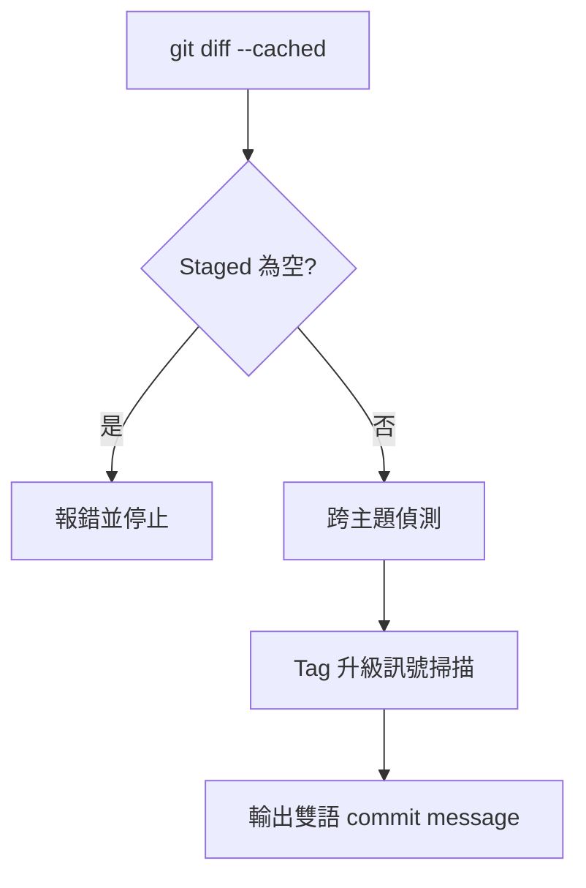

> [!NOTE]
> 此 README 由 [SKILL](https://github.com/pardnchiu/skill-readme-generate) 生成，英文版請參閱 [這裡](../README.md)。

***

<strong>WRITE BILINGUAL COMMITS FROM STAGED DIFF WITH STRICT TAG DISCIPLINE!</strong>

***

> Claude Code skill，從 staged diff 產出雙語 commit message，具備強制 tag 升級與跨主題偵測

## 目錄

- [功能特點](#功能特點)
- [技術堆疊](#技術堆疊)
- [架構](#架構)
- [授權](#授權)

## 功能特點

> `/commit-generate` · [完整文件](./doc.zh.md)

- **雙語一次輸出** — 同一次呼叫同時產出英文 subject 與繁體中文 body，避免雙語不同步或漂移。
- **Staged-only 嚴格輸入** — 僅讀 `git diff --cached`，未 staged 直接報錯，拒絕 fallback 至工作區。
- **Tag 強制升級訊號** — 掃描 Breaking / Security 訊號，命中即升級 Tag，禁止降級為 `feat` 或 `update`。
- **跨主題偵測** — 同次 diff 觸及 2+ primary tag 或 3+ 無關主題時先警示拆分，再輸出概括訊息。
- **13 種分類 Tag** — 依 `BREAKING` > `FEAT` > `FIX` > `SECURITY` > `UPDATE` > `REFACTOR` > `PERF` 優先序統一決策。

## 技術堆疊

## 架構

> [完整架構](./architecture.zh.md)

## 授權

本專案採用 [MIT LICENSE](../LICENSE)。
