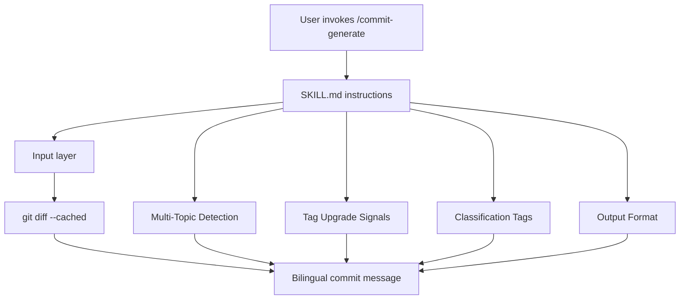
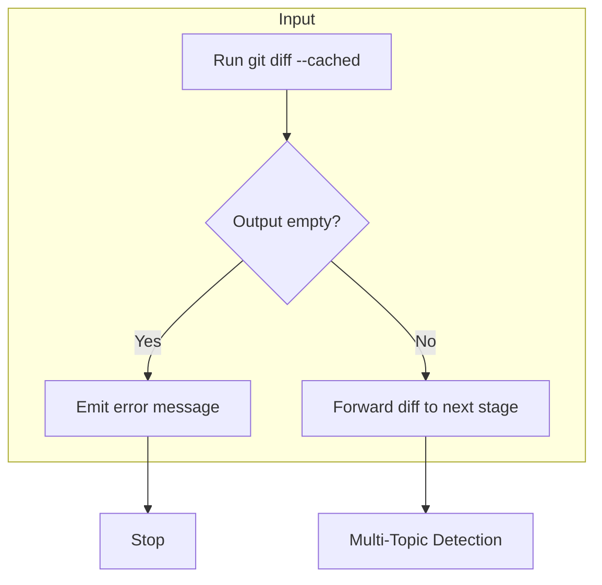
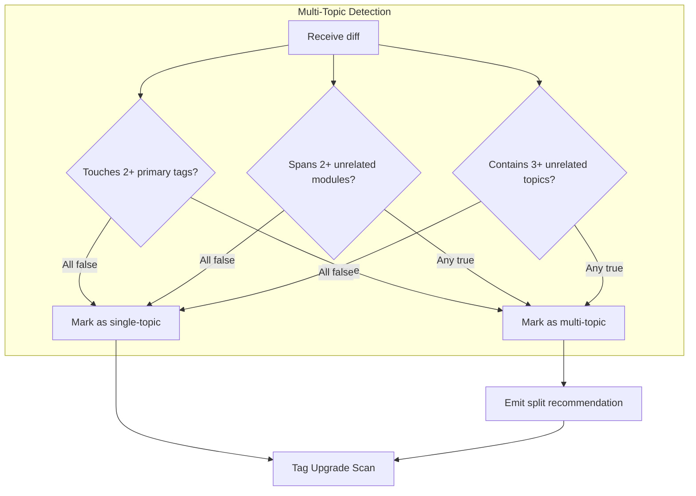
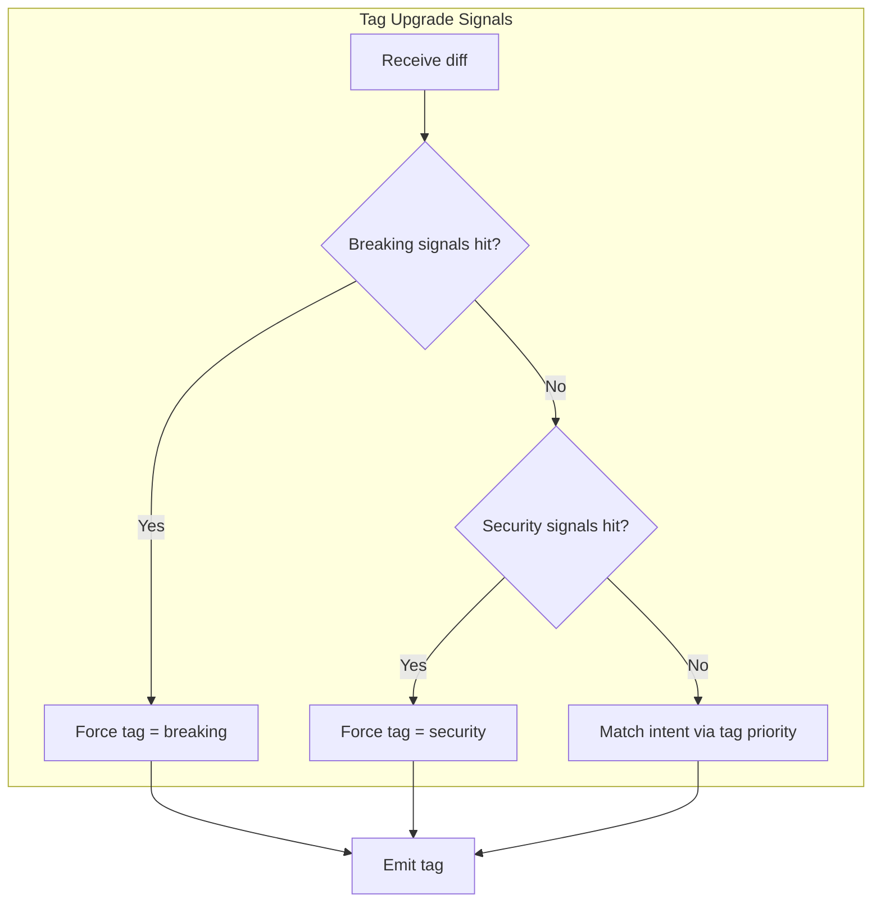
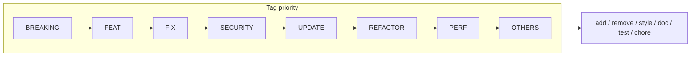
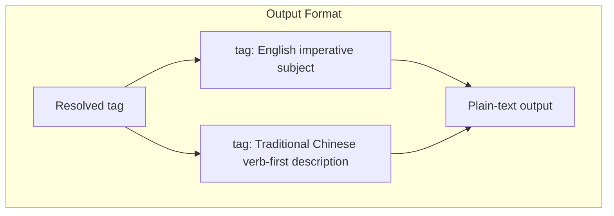
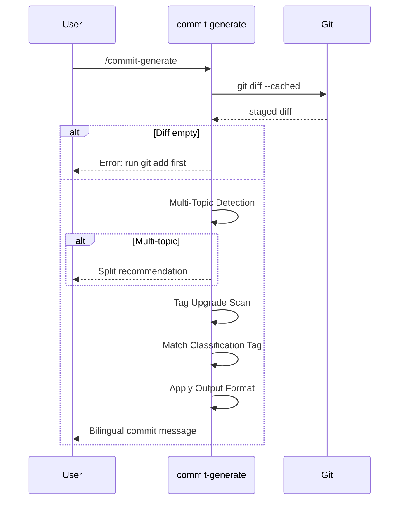
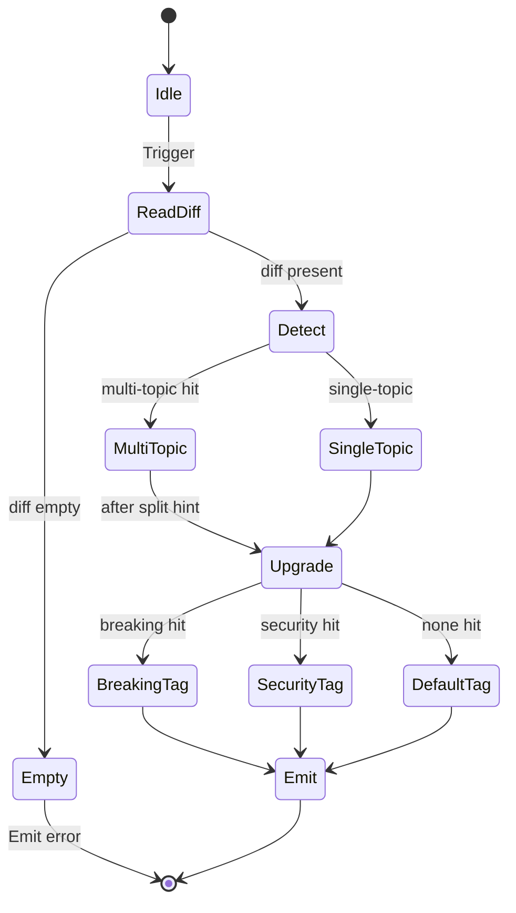

# commit-generate - Architecture

> Back to [README](../README.md)

## Overview

## Module: Input

Reads and validates the staged diff. Aborts when nothing is staged; never falls back to the working tree.

## Module: Multi-Topic Detection

Decides whether a single diff mixes unrelated intents and, if so, emits a split recommendation.

## Module: Tag Upgrade Signals

Scans signals top-down; any hit forces an upgrade and blocks downgrades to `feat` or `update`.

## Module: Classification Tags

Final tag resolves through a fixed priority order.

## Module: Output Format

Fixed two-line format: English subject on line 1, Traditional Chinese body on line 2.

## Data Flow

## State Machine

