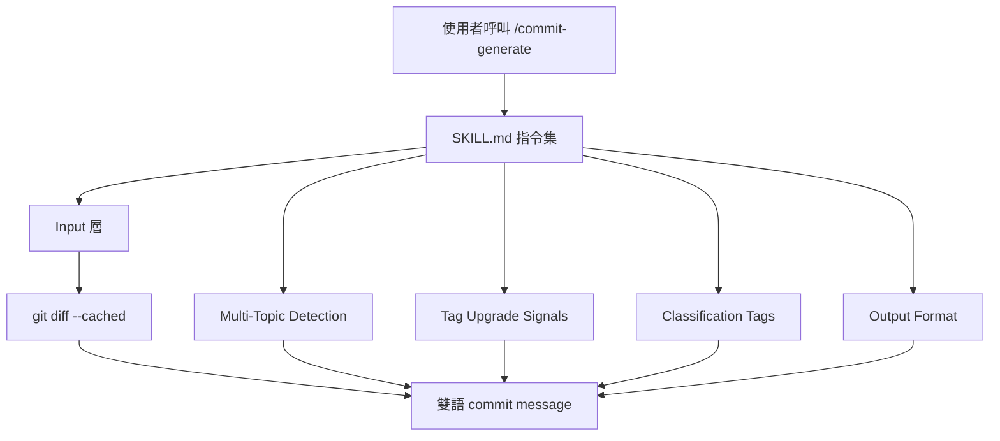
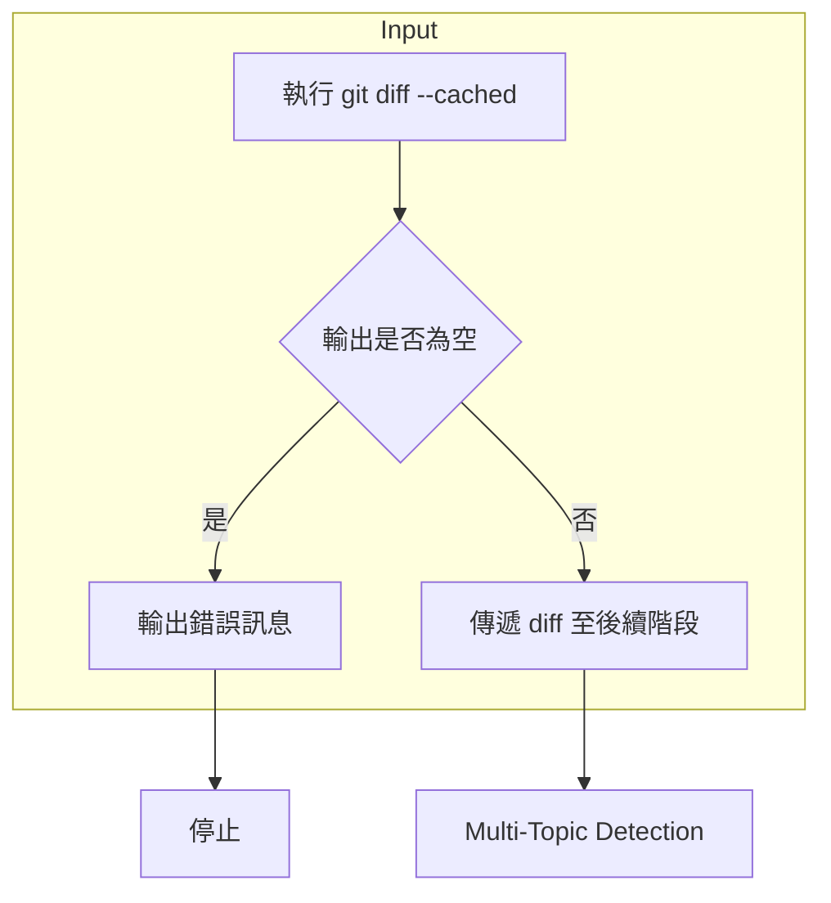
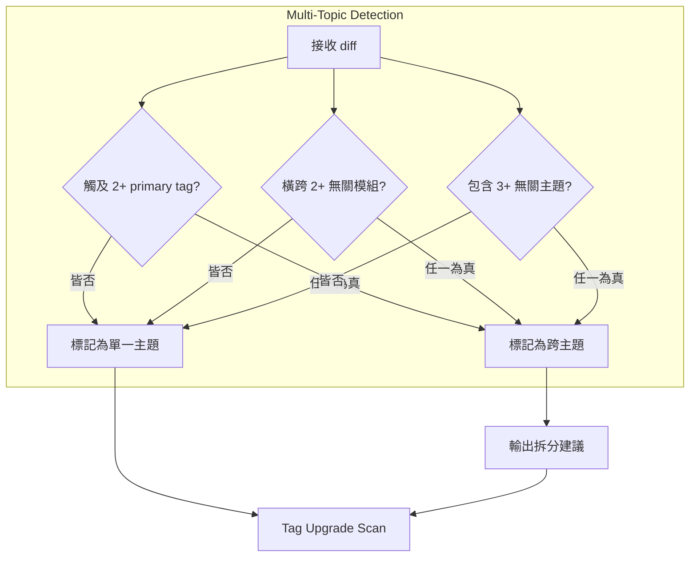
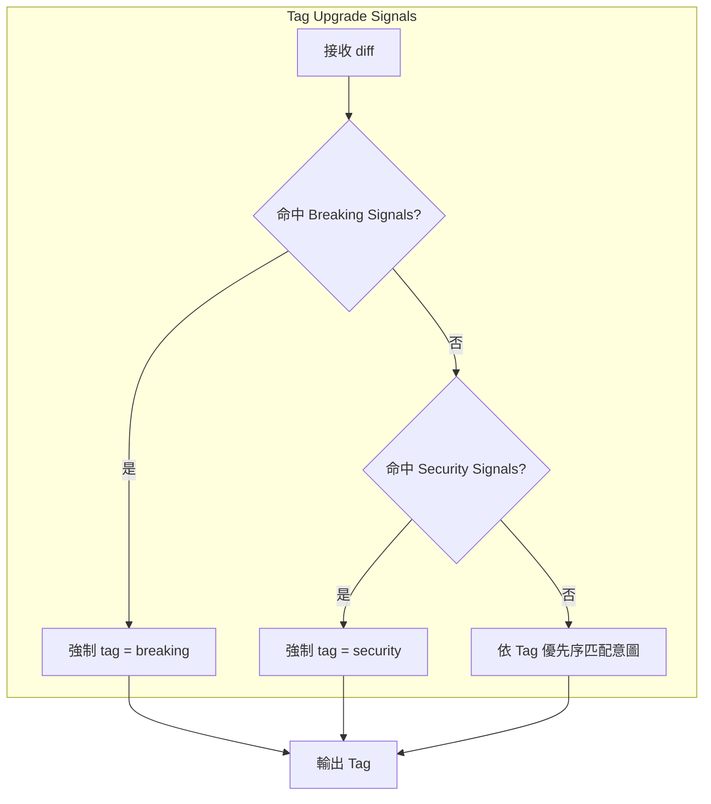
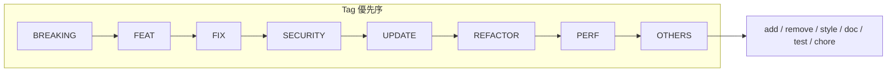
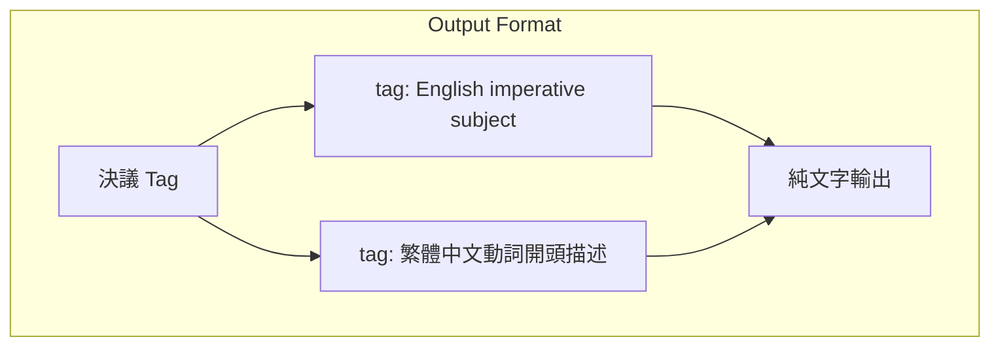
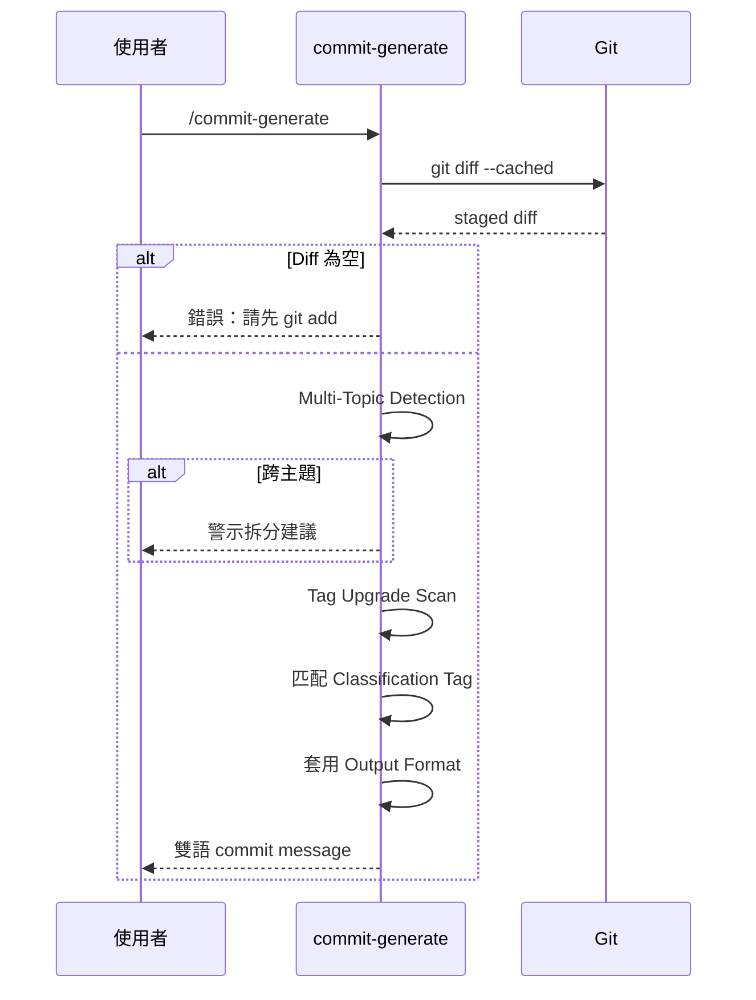
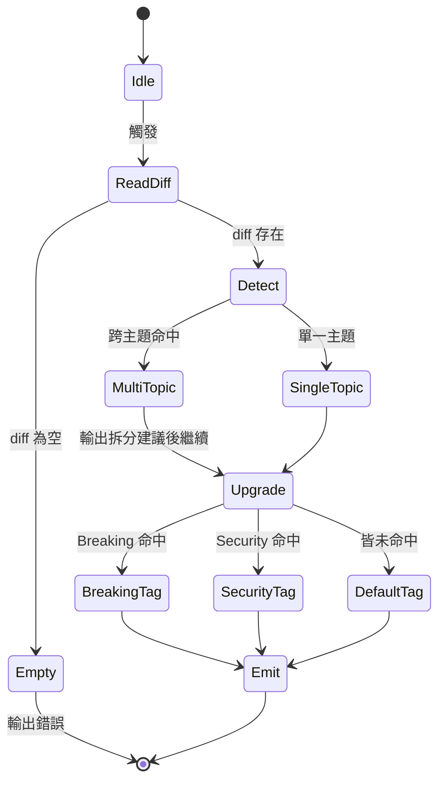

# commit-generate - 架構

> 返回 [README](./README.zh.md)

## Overview

## Module: Input

負責取得並驗證 staged diff。無 staged 時直接終止，不 fallback 至工作區。

## Module: Multi-Topic Detection

判斷單一 diff 是否混合多個不相關意圖，若命中則要求警示拆分。

## Module: Tag Upgrade Signals

由上而下掃描訊號，命中即強制升級 Tag，禁止降級為 feat / update。

## Module: Classification Tags

最終 Tag 選擇依固定優先序決議。

## Module: Output Format

固定雙行格式，第一行英文 subject、第二行繁體中文 body。

## Data Flow

## State Machine

